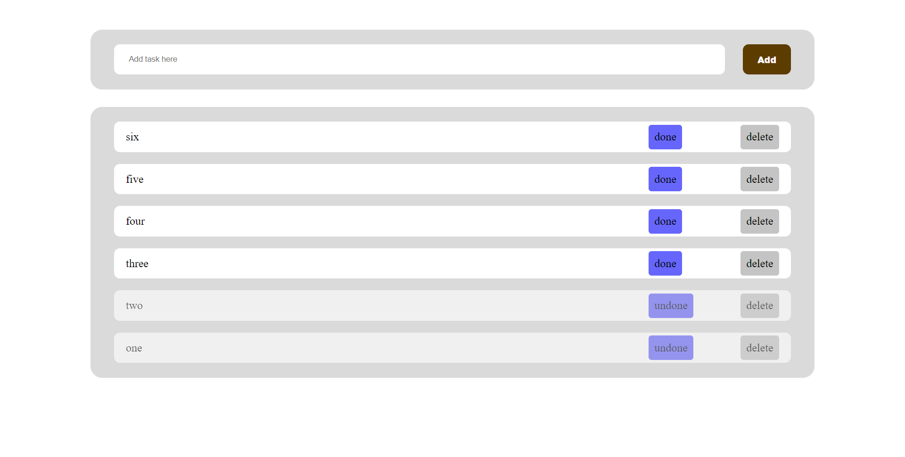

# TODO list

## Table of contents

- [Overview](#overview)
  - [Screenshot](#screenshot)
  - [Links](#links)
- [Built with](#built-with)
- [Author](#author)

## Overview

this is a simple TODO list where you can add tasks, remove them and mark them as done, and the data would be saved in the local storage so you would find you tasks even if you reload the page or exit it and enter again

### Screenshot

### Links

- Solution URL: [Github repo](https://github.com/mohamedkhaled4053/TODO-list)
- Live Site URL: [Github page](https://mohamedkhaled4053.github.io/TODO-list/)

## Built with

- Semantic HTML5 markup
- CSS custom properties
- Flexbox
- Mobile-first workflow
- JavaScript

## Author

- Upwork - [Mohamed khaled](https://www.upwork.com/freelancers/~01a5a737ea63245d57)
- Github - [mohamed khaled](https://github.com/mohamedkhaled4053)
- linkedin - [mohamed khaled](https://www.linkedin.com/in/mohamed-khaled-58602722b/)